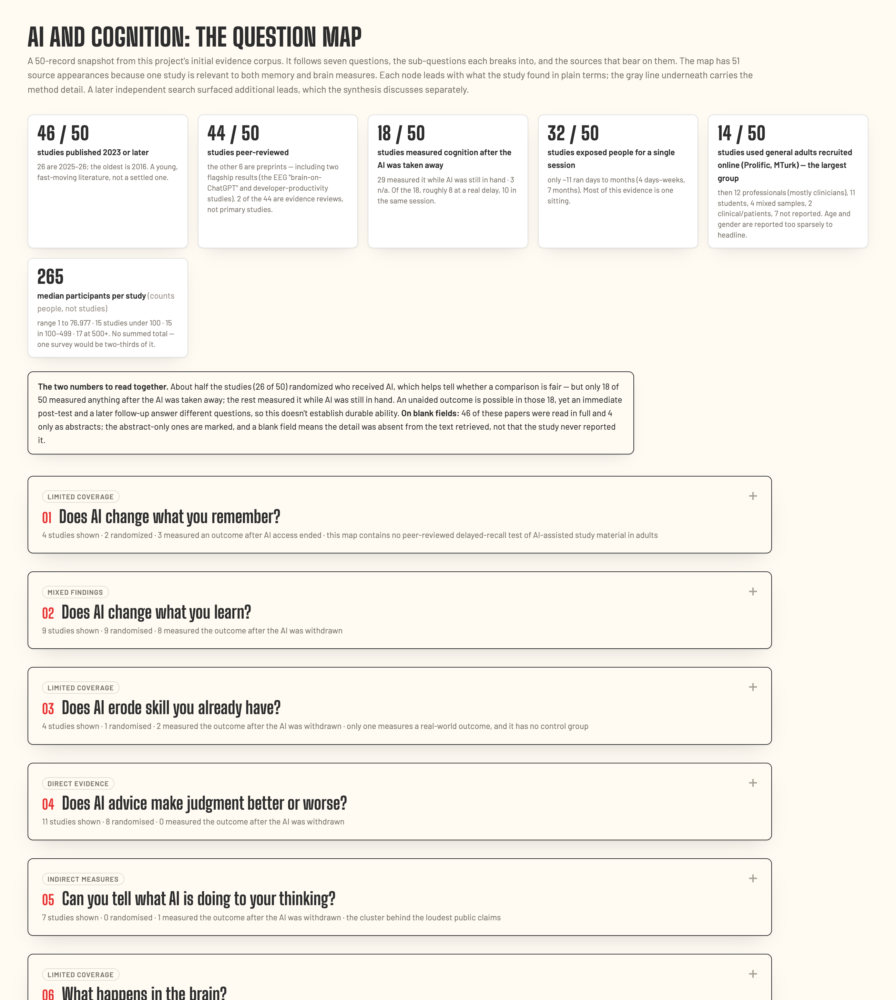

# AI and cognition

While writing [Cognitive Endurance](https://www.unmissables.xyz/p/cognitive-endurance-2), I kept seeing studies and headlines about AI weakening memory, learning, and critical thinking. I wanted to understand what researchers were investigating, how those abilities were being measured, and which questions were still open. The field is moving quickly, so I also wanted a baseline I could return to as the evidence changes—and to see how today’s findings evolve as people use AI more often, for more tasks, and over longer periods of time.

Cognitive Endurance is a two-part framework for developing stronger human-AI loops: using AI to extend intelligence while strengthening discernment, creativity, critical thinking, and independent judgment. This research began as a way to understand the evidence behind that practice.

I used Claude Science and Perplexity to build a structured review of research on memory, learning and skill, judgment, attention, self-assessment, and related brain and physiological measures. I then examined what each study had measured, whether AI was still available when the outcome was tested, and how far the findings could support the claims being made about cognition.

The project also became a record of what it was like to use two AI research environments for the same investigation. Each tool surfaced a different body of sources. Each made some parts of the work easier to see and left other gaps that only became apparent through comparison, follow-up searches, and source checking.

## What the evidence currently suggests

The clearest distinction in the corpus is between performance with AI and ability after AI is removed. A faster report, a better essay, or a more accurate answer can show that the assistance worked. Learning and skill require a later test of what the person can do independently.

Across the studies reviewed so far:

- **AI frequently improves the speed or quality of work produced while it is available.** Those gains tell us about assisted performance. Most studies stop before testing whether the person retained anything or could perform the task later without help.

- **The design of the assistance can change the result.** Guided tutoring and workflows that ask people to generate an answer before receiving help have produced different outcomes from interfaces that supply answers for direct adoption.

- **Incorrect AI recommendations can pull people toward the wrong answer.** This appears in studies involving clinicians, radiologists, misinformation, false memories, and general decision tasks. Expertise and explanations have not consistently protected people from following incorrect advice.

- **Starting ability may affect who benefits.** Several studies report larger gains among less experienced or lower-performing participants. One randomized crossover study found that the same AI reading aids helped people who began with lower scores and hurt those who began with higher scores.

- **Belief change is one of the clearest effects that has persisted after an AI interaction.** AI conversations and writing assistance have moved people’s reported beliefs toward accurate, slanted, and false claims. Some of those changes remained weeks or months later.

- **The long-term effects of ordinary AI use remain open.** A small number of studies now test people after a delay, including one unpublished 45-day retention study and a six-week nursing pilot. The available studies are too narrow to establish what months or years of regular AI use do to memory, judgment, or skill.

The [full synthesis](synthesis.md) explains these findings, the studies behind them, and the limits on each conclusion.

## How cognition is being measured

Studies grouped under “AI and cognition” often investigate different outcomes.

Some measure the quality of work completed while AI is present. Others test recall or independent performance after access ends. Some rely on people’s perceptions of their own effort, confidence, or critical thinking. Others score their answers, decisions, arguments, or ability to detect an error.

This matters because the measures support different conclusions.

| Capacity | What the study needs to measure |
|---|---|
| Memory | Recall or recognition without AI, ideally after a delay |
| Learning and skill | Independent performance or transfer after practice |
| Judgment | Decisions with known-correct answers, including cases where the AI is wrong |
| Attention and cognitive control | Behavioral attention measures, observed monitoring, or validated instruments |
| Metacognition | Confidence compared with actual performance |
| Output performance | The speed, quality, or accuracy of work produced while AI is available |

A project audit found that papers using the term “critical thinking” had measured self-reported work behaviors, confidence, essay recall, and coded argument quality. These measures describe different parts of cognition and should be interpreted separately.

## How earlier technologies inform the question

People have long used technologies to support memory, navigation, calculation, writing, and decision-making. I assembled a separate corpus of 51 studies on GPS, cockpit automation, calculators, spell-check, and internet search to understand how researchers had studied cognitive offloading before generative AI.

Those studies provide analogies rather than forecasts. They show how researchers have examined what stops being practiced, what people can still do when a tool is removed, and whether a skill returns.

Generative AI expands the range of tasks a tool can participate in. It can retrieve information, explain a concept, recommend a decision, develop an argument, or produce the finished work. The earlier research helps identify which questions carry forward and where new measures may be needed.

## What is in this repository

| Resource | What it contains |
|---|---|
| [Synthesis](synthesis.md) | The findings, evidence limits, and questions the current corpus leaves open |
| [Interactive question map](https://aribajahan.github.io/ai-cognition/question-map/) | 50 selected source records organized by the questions they address |
| [Methods](methods.md) | Corpus construction, coding decisions, source access, and project limits |
| [Evidence tables](data/) | Study-level records, construct coding, and the machine-readable corpus census |
| [Research workflow](research-workflow.md) | How Claude Science and Perplexity contributed to the review |
| [Field notes](field-notes.md) | What I noticed while working with both research environments |

## Corpus and scope

Claude Science produced two evidence tables:

- A 45-record first pass across memory, learning and skill, judgment, and brain or physiological measures
- A 24-record benefit-side pass, added after the first search leaned heavily toward harm

Six sources appear in both tables, leaving **63 unique Claude Science source records**.

Perplexity produced a separate table containing **64 source records** across AI-era studies, older cognitive-offloading research, meta-analyses, and reviews. Sixteen also appear in the Claude Science corpus, leaving **48 Perplexity-only records**.

I have kept the tables separate because they came from different searches and contain different kinds of sources. The separation also preserves provenance: a reader can see which research environment surfaced each record.

The project is adult-focused. It includes a small number of studies outside a strict adult-only definition when they directly address the research question, including a high-school mathematics field experiment. Each finding should be read in light of the population, task, and form of AI assistance that the study tested.

The repository is a structured evidence review and research record. Searches were mediated by AI research tools, and the studies differ too much in their populations, interventions, and outcomes to combine into a single effect estimate.

## How I used the research tools

Claude Science and Perplexity received the same opening question and the same evidence rules: use verifiable studies, preserve the authors’ limitations, distinguish correlation from causation, and say when a detail was absent from the available source text.

Their work diverged after that opening prompt.

Claude Science became the main research workbench. It assembled the initial corpus, applied a consistent extraction structure, and produced the interactive question map. Its first search reflected the harm-oriented framing of my original question, so I asked it to run a second search focused on benefits and countervailing evidence.

Perplexity became an independent route through the question. It surfaced additional studies, reached some sources that were unavailable in the first environment, identified a retracted meta-analysis, and found delayed-retention studies in an area the first corpus had described as empty.

The comparison has an important limit: Claude Science received more prompts and more iterative development. I used Perplexity later and for a different mix of retrieval, verification, and analysis. The project documents how the tools behaved during this investigation rather than assigning a general winner.

The process also changed how I thought about trust in research tools. Claude Science’s large, polished evidence map initially made the corpus feel more complete than it was. Watching Perplexity visit sources made its work feel more transparent before I had evaluated its rigor. In both cases, the interface affected my confidence in the output.

## Source access and verification

Full text is available for all 24 records in the benefit-side table and 37 of the 45 records in the first-pass table. Eight first-pass records remain abstract-only.

“Not reported” in the evidence tables means that a detail was absent from the text retrieved for this project. The paper itself may contain additional information that the research environment could not access.

The construct classifications and other project codes were developed with AI assistance and reviewed by me. They were not independently coded by multiple researchers.

A corpus audit now checks the current row counts, duplicate records, and cross-tool overlap labels. The audit runs automatically through GitHub Actions whenever the repository changes.

The current census was verified on **September 22, 2026**. The [machine-readable census](data/corpus_census.json) preserves those counts.

## Questions I want to keep following

The baseline gives me a way to see how the evidence changes as AI use becomes more frequent, sustained, and embedded in everyday work.

I am especially interested in:

- what people stop practicing once AI becomes routinely available;
- what they can do independently after weeks or months of assisted work;
- whether changes in memory, judgment, or skill grow with heavier use;
- whether an ability returns when someone reduces or stops using AI;
- how the same assistance affects people with different starting levels of skill;
- which interface choices encourage retrieval, checking, revision, and independent judgment;
- how generative AI compares with earlier tools that took on narrower parts of a cognitive task.

## Related work

This investigation grew from [Cognitive Endurance](https://www.unmissables.xyz/p/cognitive-endurance-2), my framework for developing stronger human-AI loops while strengthening discernment, creativity, critical thinking, and independent judgment.

While building the corpus, I also created reusable workflows for source checking, structured extraction, full-text retrieval, and construct audits. They are documented in [Claude Science Skills](https://github.com/aribajahan/claude-science-skills).

By [Ariba Jahan](https://aribajahan.com)
